# API Matrix Diagram

The diagram below maps Frontend components/services, the Dev Server Proxy, and Backend FastAPI endpoints.

```mermaid
flowchart TD

subgraph Frontend["Browser / Frontend"]
  A[RepositoryIndexer.js] -->|index local repo| S1[ApiService.indexLocalRepository]
  A2[RepositoryBrowser.js] -->|list repos| S2[ApiService.getRepositories]
  A3[MultiRepoAnalysis.js] -->|canonical plan| S3[ApiService.getMultiRepoMigrationPlan]
  A3 -->|multi-repo analyze/deps/flows| S4[ApiService.analyzeMultipleRepositories]
  A4[SearchInterface.js] -->|semantic search| S5[ApiService.searchCode]
  A5[DependencyGraph.js] -->|graph viz repo| S6[ApiService.getRepositoryGraphVisualization]
  A6[ChatInterface.js] -->|ask agent| S7[ApiService.askAgent]
end

S1 --> P[Dev Server Proxy 3000 to 8080]
S2 --> P
S3 --> P
S4 --> P
S5 --> P
S6 --> P
S7 --> P

subgraph Backend["Backend :8080 / FastAPI"]
  direction TB

  %% Health
  B1[GET /api/v1/health/ and /ready/]:::health

  %% Indexer / Repository Management (inferred from UI and API usage)
  R1[GET /api/v1/index/repositories/]:::index
  R2[POST /api/v1/index/repository/]:::index
  R3[POST /api/v1/index/repository/local/]:::index
  R4[GET /api/v1/index/repositories/name]:::index
  R5[DELETE /api/v1/index/repository/name]:::index

  %% Query Router
  Q1[POST /api/v1/query/semantic/]:::query
  Q2[GET /api/v1/query/similar/chunk_id]:::query
  Q3[POST /api/v1/query/graph/]:::query
  Q4[GET /api/v1/query/dependencies/transitive/artifact]:::query
  Q5[GET /api/v1/query/dependencies/conflicts]:::query
  Q6[GET /api/v1/query/dependencies/circular]:::query
  Q7[GET /api/v1/query/code/relationships/chunk_id]:::query
  Q8[GET /api/v1/query/domains/domain/dependencies]:::query
  Q9[GET /api/v1/query/artifacts/most-connected]:::query
  Q10[GET /api/v1/query/repositories/name/health]:::query
  Q11[GET /api/v1/query/search/hybrid]:::query
  Q12[GET /api/v1/query/statistics]:::query

  %% Multi-repo
  M1[POST /api/v1/query/multi-repo/analyze]:::multi
  M2[GET /api/v1/query/multi-repo/repositories]:::multi
  M3[POST /api/v1/query/multi-repo/business-flows]:::multi
  M4[POST /api/v1/query/multi-repo/dependencies/cross-repo]:::multi
  M5[POST /api/v1/query/multi-repo/migration-impact]:::multi
  M6[GET /api/v1/query/multi-repo/integration-points]:::multi

  %% Canonical Migration Plan
  C1[GET /api/v1/migration-plan]:::plan

  %% Chat
  H1[POST /api/v1/chat/ask]:::chat

  %% Graph Visualization
  GV[GET /api/v1/graph/visualization]:::viz
end

%% Mappings from Frontend services to Backend
S1 --> R3
S2 --> R1
S3 --> C1
S4 --> M1
S4 --> M3
S4 --> M4
S4 --> M5
S5 --> Q1
S6 --> GV
S7 --> H1

classDef health fill:#e8f5e9,stroke:#1b5e20,stroke-width:1px,color:#1b5e20
classDef index fill:#e3f2fd,stroke:#0d47a1,stroke-width:1px,color:#0d47a1
classDef query fill:#fff3e0,stroke:#e65100,stroke-width:1px,color:#e65100
classDef multi fill:#f3e5f5,stroke:#4a148c,stroke-width:1px,color:#4a148c
classDef plan fill:#ede7f6,stroke:#311b92,stroke-width:1px,color:#311b92
classDef chat fill:#ffebee,stroke:#b71c1c,stroke-width:1px,color:#b71c1c
classDef viz fill:#e0f7fa,stroke:#006064,stroke-width:1px,color:#006064
```

Contract alignment notes

- Semantic Search backend shape is defined in [src/api/routes/query.py](src/api/routes/query.py:147) via `SemanticSearchRequest` with fields: query, limit, min_score, repository_filter (string), language_filter, domain_filter, chunk_type_filter, include_metadata.
- Graph Query requires `GraphQueryRequest` in [src/api/routes/query.py](src/api/routes/query.py:250): cypher (required), parameters (object), read_only (bool default true), timeout (int default 30).
- Multi-repo suite is under [src/api/routes/query.py](src/api/routes/query.py:618) covering analyze, repositories, business-flows, cross-repo dependencies, migration-impact, and integration-points.
- Canonical migration plan is served via GET /api/v1/migration-plan and implemented by planner in [src/services/migration_planner.py](src/services/migration_planner.py:60).
- Chat endpoint contract is in [src/api/routes/chat.py](src/api/routes/chat.py:59) `ChatAskRequest` and `ChatAskResponse`.

Usage guidance

- Frontend should avoid issuing POST /api/v1/query/graph without a valid cypher; add a client-side guard if needed in ApiService.executeGraphQuery.
- Graph Visualization route (GV) must bind repository param into the Cypher (parameters = { "repository": repository }) to avoid Neo4j ParameterMissing for $repository.