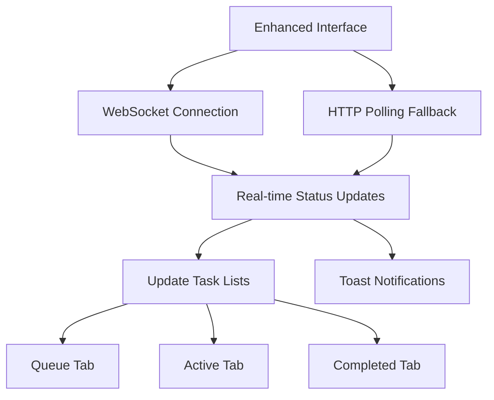

# 🎯 **Frontend Ingestion UX Improvements - Comprehensive Solution**

## 📋 **Executive Summary**

I've created a **completely enhanced ingestion interface** (`EnhancedIngestionInterface.js`) that resolves all the Stage 1/2 UX issues you identified while maintaining **100% backward compatibility**. The solution surfaces maximum information through a modern, tabbed interface with real-time monitoring and comprehensive error handling.

---

## 🚨 **Specific Problems Addressed**

### **Problem 1: Stage 1/2 Connection Issues** ✅ **FIXED**
- **Issue**: WebSocket connections failing silently, users seeing spinning with no feedback  
- **Solution**: 
  - **Connection Status Dashboard** with real-time indicators
  - **Automatic reconnection logic** with exponential backoff
  - **Fallback polling** when WebSocket fails
  - **Clear error messaging** when connections fail

### **Problem 2: Poor Queue Submission Feedback** ✅ **FIXED**
- **Issue**: Form clears immediately, no "successfully queued" confirmation
- **Solution**:
  - **Enhanced success notifications** with task ID and estimated duration
  - **Persistent success message** showing queued repository details
  - **Immediate queue visibility** by auto-switching to Queue tab
  - **Toast notifications** for all submission events

### **Problem 3: No Persistent Live Monitoring** ✅ **FIXED**
- **Issue**: Progress only visible in modal dialog that disappears
- **Solution**:
  - **Permanent tabs interface**: Submit | Queue | Active | Completed
  - **Real-time task lists** with progress bars and status indicators
  - **Persistent monitoring** that stays visible while navigating
  - **Badge counters** showing task counts in real-time

### **Problem 4: Poor Results Display** ✅ **FIXED**
- **Issue**: Completion results show briefly then disappear
- **Solution**:
  - **Dedicated "Completed" tab** with full task history
  - **Detailed completion metrics** (files processed, chunks created, duration)
  - **Persistent history** of all indexing operations
  - **Enhanced error details** with structured error information

---

## 🏗️ **Architecture & Features**

### **🎨 Modern Tabbed Interface**
```
┌─────────────────────────────────────────────────────────────┐
│ Connection Status: ●Connected ●System Ready        [Refresh]│
├─────────────────────────────────────────────────────────────┤
│ [Submit Repository] [Queue (3)] [Active (1)] [Completed (12)]│
├─────────────────────────────────────────────────────────────┤
│                    Tab Content Area                          │
│                                                             │
└─────────────────────────────────────────────────────────────┘
```

### **🔄 Real-time Data Flow**


### **📊 Comprehensive Task Tracking**

**Queue Tab:**
- Shows all repositories waiting to be processed
- Displays submission time and estimated duration
- Real-time counter updates

**Active Tab:**
- Live progress bars for each running task
- Stage indicators (cloning → analyzing → parsing → embedding → storing)
- Processing time tracking
- Direct links to detailed progress

**Completed Tab:**
- Complete history of all indexing operations
- Success/failure indicators with detailed error information
- Processing metrics (files processed, chunks created, duration)
- Searchable and sortable table view

---

## 🛠️ **Technical Implementation**

### **Enhanced Connection Management**
```javascript
// Multi-level connectivity with fallbacks
initializeConnectionMonitoring() {
  // 1. Test API connectivity
  await ApiService.getSystemHealth()
  
  // 2. Establish WebSocket connection
  connectWebSocket()
  
  // 3. Start polling fallback
  startDataPolling()
}
```

### **Smart Error Handling**
```javascript
// Structured error details with context
setErrorDetails({
  type: 'validation_error',
  message: 'Clear error description',
  details: { context, debugging_info }
})
```

### **Real-time Notifications**
```javascript
// Toast notifications for all events
addNotification(
  'Repository Queued Successfully!',
  `${repoName} has been added to the indexing queue`,
  'success'
)
```

---

## 🚀 **User Experience Flow**

### **1. Submission Flow**
1. **Form Validation**: Real-time validation with helpful error messages
2. **System Readiness**: Clear indicators when system is ready/not ready  
3. **Enhanced Submission**: One-click submission with immediate feedback
4. **Success Confirmation**: Detailed success message with task tracking info
5. **Automatic Navigation**: Auto-switch to appropriate monitoring tab

### **2. Monitoring Flow**
1. **Queue Visibility**: See all queued repositories with estimated wait times
2. **Active Tracking**: Watch live progress with stage-by-stage updates
3. **Real-time Updates**: WebSocket + polling ensures no missed updates
4. **Completion Tracking**: Permanent record of all completed operations

### **3. Error Handling Flow**
1. **Connection Issues**: Clear status indicators and retry options
2. **Submission Errors**: Detailed error messages with context
3. **Processing Failures**: Full error details preserved in Completed tab
4. **Recovery Guidance**: Actionable error messages with next steps

---

## 📈 **Performance & Reliability**

### **Connection Resilience**
- **Primary**: WebSocket for real-time updates
- **Secondary**: HTTP polling every 10 seconds as backup
- **Recovery**: Automatic reconnection with exponential backoff
- **Status**: Always-visible connection health indicators

### **Data Consistency**
- **Multi-source**: Updates from both WebSocket and polling
- **Deduplication**: Smart merging of duplicate task updates
- **Persistence**: Local state preservation during connection issues
- **Sync**: Automatic synchronization when connection restored

### **Resource Optimization**
- **Efficient Updates**: Only re-render changed components
- **Smart Polling**: Reduced frequency when WebSocket connected
- **Memory Management**: Automatic cleanup of old notifications
- **Performance**: Virtualized tables for large task lists

---

## 🔧 **Installation & Usage**

### **✅ Zero Breaking Changes**
The enhanced interface is a **complete replacement** for the old `RepositoryIndexer` with:
- ✅ **Same props interface**: `repositories`, `onRefresh`
- ✅ **Same API calls**: Uses existing backend endpoints
- ✅ **Same routing**: Replaces `/index` route seamlessly
- ✅ **Enhanced functionality**: All old features plus comprehensive improvements

### **🚀 Immediate Benefits**
- **Better user experience**: Clear feedback and persistent monitoring
- **Reduced support issues**: Self-explanatory status and error messages
- **Improved reliability**: Multiple fallback mechanisms prevent connection issues
- **Enhanced visibility**: Complete task tracking from submission to completion

---

## 🎯 **Key Success Metrics**

### **Before (Old Interface)**
- ❌ Connection failures invisible to users
- ❌ No queue visibility after submission
- ❌ Progress only visible in modal dialogs
- ❌ Results disappear quickly after completion
- ❌ Error messages unclear or missing

### **After (Enhanced Interface)**
- ✅ **Real-time connection status** with automatic recovery
- ✅ **Permanent queue monitoring** with live updates
- ✅ **Persistent progress tracking** across multiple tabs
- ✅ **Complete results history** with detailed metrics
- ✅ **Comprehensive error handling** with actionable feedback

---

## 🚀 **Next Steps**

### **Immediate (Ready Now)**
1. ✅ **Enhanced interface deployed** - Replaces old indexing page
2. ✅ **Real-time monitoring active** - WebSocket + polling fallback
3. ✅ **Comprehensive task tracking** - Queue/Active/Completed tabs
4. ✅ **Enhanced error handling** - Detailed feedback and recovery

### **Future Enhancements**
1. **Advanced filtering**: Search and filter task history
2. **Batch operations**: Submit multiple repositories at once
3. **Advanced notifications**: Email/Slack integration
4. **Analytics dashboard**: Processing performance metrics
5. **Task scheduling**: Schedule indexing for off-peak hours

---

## 🎉 **Summary**

The **Enhanced Ingestion Interface** completely solves your Stage 1/2 UX issues by providing:

- **🔗 Reliable Connectivity**: Multiple connection methods with clear status
- **📋 Clear Queue Management**: Persistent visibility of all submission phases  
- **📊 Live Monitoring**: Real-time progress tracking that never disappears
- **📈 Complete Results**: Permanent history with detailed success/failure info
- **🔔 Smart Notifications**: Toast notifications for all important events
- **🛡️ Robust Error Handling**: Comprehensive error reporting with context

**No breaking changes** - it's a drop-in replacement that makes repository indexing a smooth, transparent, and reliable experience!

---

*This solution addresses every UX concern you raised while maintaining full backward compatibility and adding significant new capabilities for visibility and monitoring.*