# GraphRAG Repository Ingestion Architecture

## 📊 **Complete Data Ingestion Flow Diagram**

```mermaid
graph TB
    %% Entry Points
    API[🌐 API Layer<br/>FastAPI Endpoints] --> APIRoutes{Route Type}
    APIRoutes -->|Single Repo| IndexRepo[📝 /index/repository]
    APIRoutes -->|Local Path| IndexLocal[📂 /index/local]
    APIRoutes -->|Multiple| BulkIndex[📦 /index/bulk]
    
    %% Request Processing
    IndexRepo --> ReqValidation[✅ Request Validation<br/>& Task ID Creation]
    IndexLocal --> ReqValidation
    BulkIndex --> ReqValidation
    
    ReqValidation --> Redis1[🔴 Redis Status Init<br/>Create task_status:*]
    Redis1 --> BackgroundTask[⚡ Background Task Queue]
    
    %% Core Processing Pipeline
    BackgroundTask --> RepoProcessor[🏭 Repository Processor v2]
    RepoProcessor --> Semaphore[🚦 Concurrency Control<br/>max_concurrent_repos]
    
    Semaphore --> Phase1[📋 Phase 1: Preparation<br/>0-20% Progress]
    Phase1 --> GitClone[📥 Git Clone/Prepare<br/>Workspace Management]
    GitClone --> Redis2[🔴 Redis Progress<br/>cloning -> 20%]
    
    Redis2 --> Phase2[🔍 Phase 2: Analysis<br/>20-40% Progress]
    Phase2 --> RepoAnalysis[📊 Repository Analysis<br/>File discovery<br/>Language detection<br/>LOC counting<br/>Directory structure]
    RepoAnalysis --> Redis3[🔴 Redis Progress<br/>analyzing -> 40%]
    
    Redis3 --> Phase3[⚙️ Phase 3: Code Processing<br/>40-80% Progress]
    Phase3 --> TreeSitter[🌳 Tree-Sitter Parsing<br/>AST generation<br/>Symbol extraction<br/>Code structure analysis]
    TreeSitter --> CodeChunker[✂️ Code Chunking<br/>Function-level chunks<br/>Class-level chunks<br/>Semantic boundaries]
    CodeChunker --> Redis4[🔴 Redis Progress<br/>parsing -> 80%]
    
    Redis4 --> Phase4[🧠 Phase 4: Embedding<br/>80-85% Progress]
    Phase4 --> EmbeddingGen[🤖 CodeBERT Embeddings<br/>Content extraction<br/>Batch processing 8 items<br/>768-dim vectors<br/>Error resilience]
    EmbeddingGen --> EnhancedChunks[💎 Enhanced Chunks<br/>chunk + metadata + embeddings]
    EnhancedChunks --> Redis5[🔴 Redis Progress<br/>embedding -> 85%]
    
    Redis5 --> Phase5[💾 Phase 5: Storage<br/>85-95% Progress]
    Phase5 --> ParallelStorage{Parallel Storage}
    
    %% Storage Systems
    ParallelStorage --> ChromaStorage[🟦 ChromaDB Storage]
    ParallelStorage --> Neo4jStorage[🟩 Neo4j Storage]
    
    ChromaStorage --> ChromaOps[📚 ChromaDB Operations<br/>Collection creation<br/>Vector insertion<br/>Metadata indexing<br/>Embedding storage]
    Neo4jStorage --> Neo4jOps[🕸️ Neo4j Operations<br/>Repository nodes<br/>File relationships<br/>Code structure graph<br/>Maven dependencies]
    
    ChromaOps --> Redis6[🔴 Redis Progress<br/>storing -> 95%]
    Neo4jOps --> Redis6
    
    %% Maven Processing (Optional)
    Phase3 --> MavenCheck{Maven Enabled?}
    MavenCheck -->|Yes| MavenParser[☕ Maven Processing<br/>POM analysis<br/>Dependency resolution<br/>Artifact relationships]
    MavenCheck -->|No| Phase5
    MavenParser --> Phase5
    
    %% Completion & Validation
    Redis6 --> Phase6[✅ Phase 6: Validation<br/>95-100% Progress]
    Phase6 --> DataValidation[🔬 Data Validation<br/>Chunk count verification<br/>Storage consistency<br/>Error checking]
    DataValidation --> Redis7[🔴 Redis Final Status<br/>completed/failed]
    
    %% Real-time Updates
    Redis1 --> WebSocketBroadcast[📡 WebSocket Broadcasting]
    Redis2 --> WebSocketBroadcast
    Redis3 --> WebSocketBroadcast
    Redis4 --> WebSocketBroadcast
    Redis5 --> WebSocketBroadcast
    Redis6 --> WebSocketBroadcast
    Redis7 --> WebSocketBroadcast
    
    WebSocketBroadcast --> Frontend[🖥️ Enhanced Frontend UI<br/>Tabbed interface with persistent monitoring]
    
    %% Error Handling
    RepoProcessor --> ErrorHandler[🚨 Error Handling<br/>Graceful degradation<br/>Retry mechanisms<br/>Status updates]
    ErrorHandler --> Redis8[🔴 Redis Error Status<br/>failed with details]
    Redis8 --> WebSocketBroadcast
    
    %% Storage Details
    subgraph "Storage Layer Details"
        ChromaDB[(🟦 ChromaDB<br/>Vector Database)]
        Neo4jDB[(🟩 Neo4j<br/>Graph Database)]
        RedisDB[(🔴 Redis<br/>Cache & Status)]
        
        ChromaDB --> ChromaCollections[📁 Collections per Repo<br/>Vectorized chunks<br/>Metadata indexing<br/>Semantic search]
        Neo4jDB --> GraphNodes[🕸️ Graph Structure<br/>Repository nodes<br/>File relationships<br/>Code dependencies<br/>Maven artifacts]
        RedisDB --> StatusTracking[⏰ Status Management<br/>task_status keys<br/>Progress updates<br/>Error tracking<br/>WebSocket pub/sub]
    end
    
    %% Health & Monitoring
    subgraph "Health & Monitoring"
        HealthChecks[🏥 Health Checks<br/>Database connectivity<br/>Service availability<br/>Performance metrics]
        Diagnostics[📈 Diagnostics<br/>Processing statistics<br/>Error analytics<br/>Performance insights]
        Logging[📝 Structured Logging<br/>Stage tracking<br/>Performance metrics<br/>Error context]
    end
    
    ChromaOps --> HealthChecks
    Neo4jOps --> HealthChecks
    Redis6 --> Diagnostics
    RepoProcessor --> Logging
    
    %% Styling
    classDef apiStyle fill:#e1f5fe,stroke:#01579b,stroke-width:2px
    classDef redisStyle fill:#ffebee,stroke:#c62828,stroke-width:2px
    classDef chromaStyle fill:#e3f2fd,stroke:#1565c0,stroke-width:2px
    classDef neo4jStyle fill:#e8f5e8,stroke:#2e7d32,stroke-width:2px
    classDef processStyle fill:#fff3e0,stroke:#ef6c00,stroke-width:2px
    
    class API,IndexRepo,IndexLocal,BulkIndex apiStyle
    class Redis1,Redis2,Redis3,Redis4,Redis5,Redis6,Redis7,Redis8,RedisDB,StatusTracking redisStyle
    class ChromaStorage,ChromaOps,ChromaDB,ChromaCollections chromaStyle
    class Neo4jStorage,Neo4jOps,Neo4jDB,GraphNodes neo4jStyle
    class RepoProcessor,Phase1,Phase2,Phase3,Phase4,Phase5,Phase6 processStyle
```



## 🏗️ **Architecture Overview**

The GraphRAG ingestion system is a sophisticated, multi-stage pipeline that transforms raw repositories into queryable knowledge graphs and vector databases. The architecture follows a **dependencies-first approach** with comprehensive error handling and real-time progress tracking.

### **Core Design Principles**

1. **Async-First Architecture**: Pure asyncio implementation eliminates threading/pickling issues
2. **Progressive Storage**: Data flows through analysis → processing → embedding → storage
3. **Real-time Monitoring**: WebSocket-based progress tracking with Redis pub/sub
4. **Resilient Processing**: Graceful degradation and comprehensive error handling
5. **Semantic Understanding**: CodeBERT embeddings for superior code comprehension

---

## 💾 **Storage Systems Integration**

### 🔴 **Redis - Status & Coordination Hub**

**Primary Functions:**
- **Task Status Management**: Stores `task_status:*` keys for each ingestion task
- **Progress Tracking**: Real-time updates with percentage completion and stage details
- **WebSocket Pub/Sub**: Broadcasts status updates to connected frontend clients
- **Error Coordination**: Centralizes error reporting and recovery tracking

**Data Structures:**
```json
{
  "task_id": "repo_12345",
  "repository_name": "example-repo",
  "status": "in_progress",
  "current_stage": "embedding",
  "overall_progress": 75.0,
  "stage_history": [
    {"stage": "cloning", "completed_at": "2025-08-06T10:00:00Z"},
    {"stage": "analyzing", "completed_at": "2025-08-06T10:02:00Z"}
  ],
  "current_stage_progress": {
    "total_chunks": 150,
    "embedded_chunks": 112,
    "embedding_rate": 25.5
  },
  "errors": []
}
```

### 🟦 **ChromaDB - Vector Knowledge Store**

**Primary Functions:**
- **Vector Storage**: Stores 768-dimensional CodeBERT embeddings for each code chunk
- **Semantic Search**: Enables natural language queries against code semantics  
- **Collection Management**: One collection per repository for isolation
- **Metadata Indexing**: Stores file paths, languages, chunk types, and business domains

**Data Flow:**
1. Enhanced chunks (code + metadata + embeddings) → ChromaDB client
2. Collection created/retrieved for repository
3. Batch insertion of vectors with metadata
4. Automatic indexing for fast retrieval

**Storage Schema:**
- **Documents**: Raw code chunk content
- **Embeddings**: 768-dim CodeBERT vectors
- **Metadata**: `{language, chunk_type, file_path, business_domain, importance_score}`
- **IDs**: Unique identifiers linking to Neo4j nodes

### 🟩 **Neo4j - Structural Knowledge Graph**

**Primary Functions:**
- **Repository Metadata**: Central repository nodes with comprehensive metadata
- **File Relationships**: Directory structure and file dependencies
- **Code Structure**: Function/class/module relationships within files
- **Maven Dependencies**: External library and artifact relationships

**Graph Schema:**
```cypher
// Repository Node
(:Repository {name, url, branch, languages, file_count, lines_of_code})

// File Structure
(:Repository)-[:CONTAINS]->(:File {path, language, chunk_count})
(:File)-[:HAS_CHUNK]->(:CodeChunk {id, type, start_line, end_line})

// Maven Dependencies
(:Repository)-[:DEPENDS_ON]->(:MavenArtifact {group_id, artifact_id, version})
(:MavenArtifact)-[:DEPENDS_ON]->(:MavenArtifact)
```

---

## 🔄 **Complete Data Flow Explanation**

### **Stage 1: API Request Processing (0-5%)**

1. **Enhanced Request Validation**: Frontend validates input with real-time feedback and connection status checking
2. **Task ID Generation**: UUID-based task identifier created for tracking with immediate user feedback
3. **Redis Initialization**: Initial status record created in Redis with `task_status:{task_id}`
4. **Background Queue**: Request queued for asynchronous processing via FastAPI BackgroundTasks
5. **Frontend Confirmation**: Enhanced success notification with task details and automatic tab navigation to monitoring

### **Stage 2: Repository Preparation (5-20%)**

1. **Concurrency Control**: Semaphore limits concurrent repositories (default: 3-5)
2. **Git Operations**: Repository cloned to workspace directory or local path validated
3. **Workspace Management**: Directory structure prepared for processing
4. **Status Update**: Redis updated with cloning progress, WebSocket broadcast to frontend

### **Stage 3: Repository Analysis (20-40%)**

1. **File Discovery**: Recursive directory traversal identifies processable files
2. **Language Detection**: File extensions mapped to supported languages
3. **Statistics Collection**: Lines of code, file counts, language distribution calculated
4. **Structure Analysis**: Directory hierarchy and file relationships mapped
5. **Status Update**: Analysis results stored in Redis with progress updates

### **Stage 4: Code Processing & Parsing (40-80%)**

1. **Tree-Sitter Parsing**: AST generation for supported languages (Python, Java, JavaScript, etc.)
2. **Symbol Extraction**: Functions, classes, variables, imports identified
3. **Semantic Chunking**: Code divided into meaningful chunks with context preservation
4. **Metadata Enrichment**: Each chunk annotated with language, type, location data
5. **Progress Updates**: Per-file processing updates broadcast via Redis/WebSocket

### **Stage 5: Embedding Generation (80-85%)**

1. **Content Extraction**: Clean code content extracted from chunks
2. **Batch Processing**: Chunks processed in batches of 8 for stability
3. **CodeBERT Encoding**: 768-dimensional embeddings generated for semantic understanding
4. **Error Resilience**: Failed embeddings replaced with zero vectors, processing continues
5. **Enhancement**: Chunks combined with embeddings and business metadata

### **Stage 6: Parallel Storage (85-95%)**

**ChromaDB Storage:**
- Collection creation/retrieval for repository
- Vector batch insertion with metadata
- Embedding indexing for fast semantic search

**Neo4j Storage:**
- Repository node creation/update with metadata
- File relationship graph construction
- Code structure relationship mapping
- Maven dependency graph creation (if enabled)

### **Stage 7: Validation & Completion (95-100%)**

1. **Data Consistency**: Chunk counts verified between systems
2. **Storage Validation**: Successful writes to both ChromaDB and Neo4j confirmed
3. **Final Status**: Redis updated with completion status and comprehensive metrics
4. **Cleanup**: Temporary files and resources cleaned up

---

## ⚡ **Real-time Progress & Monitoring**

### **Enhanced Frontend Interface (2025-08-06 Update)**
The frontend now features a **comprehensive tabbed interface** that provides persistent monitoring and enhanced user experience:

- **Submit Tab**: Enhanced repository submission with real-time validation and connection status
- **Queue Tab**: Live visibility of all queued repositories with submission details
- **Active Tab**: Real-time progress monitoring with stage-by-stage updates and progress bars
- **Completed Tab**: Permanent history of all indexing operations with detailed metrics

### **WebSocket Integration**
- **Live Updates**: Frontend receives real-time progress via WebSocket connections with HTTP polling fallback
- **Stage Transitions**: Detailed progress for each processing phase with visual indicators
- **Error Notifications**: Immediate error reporting with structured context and troubleshooting guidance
- **Multi-client Support**: Multiple frontend clients can monitor same task
- **Connection Resilience**: Automatic reconnection with exponential backoff and status indicators

### **Status Data Structure**
```typescript
interface IngestionStatus {
  task_id: string;
  repository_name: string;
  status: 'pending' | 'in_progress' | 'completed' | 'failed';
  current_stage: 'cloning' | 'analyzing' | 'parsing' | 'embedding' | 'storing';
  overall_progress: number; // 0-100
  stage_history: StageProgress[];
  current_stage_progress: {
    total_files?: number;
    processed_files?: number;
    total_chunks?: number;
    embedded_chunks?: number;
    embedding_rate?: number;
  };
  errors: ProcessingError[];
  started_at: string;
  estimated_completion?: string;
}
```

---

## 🚨 **Error Handling & Resilience**

### **Multi-Level Error Handling**

1. **API Level**: Request validation, authentication, rate limiting
2. **Processing Level**: Repository access, parsing errors, dependency failures  
3. **Storage Level**: Database connectivity, transaction failures, data consistency
4. **System Level**: Resource exhaustion, timeout handling, service degradation

### **Recovery Mechanisms**

- **Graceful Degradation**: Processing continues even if embedding generation fails
- **Retry Logic**: Exponential backoff for transient failures
- **Error Aggregation**: Multiple errors collected and reported together
- **Status Preservation**: Error states preserved in Redis for debugging

### **Failure Scenarios**

| Failure Type | Impact | Recovery |
|--------------|---------|-----------|
| Git Clone Failure | Task fails immediately | Retry with different branch/auth |
| Tree-Sitter Parse Error | File skipped, processing continues | Error logged, file marked as unparseable |
| Embedding Generation Failure | Zero vectors used, processing continues | Graceful degradation maintains functionality |
| ChromaDB Connection Loss | Storage phase fails | Retry with exponential backoff |
| Neo4j Transaction Failure | Metadata not stored | Transaction rollback and retry |

---

## 🔧 **Architecture Quality Assessment & Improvements**

### **Current Strengths**

✅ **Async-First Design**: Eliminates threading/pickling issues  
✅ **Enhanced UI Experience**: Modern tabbed interface with persistent monitoring (Added 2025-08-06)  
✅ **Real-time Monitoring**: WebSocket-based progress tracking with HTTP polling fallback  
✅ **Graceful Degradation**: Continues processing despite component failures  
✅ **Comprehensive Error Handling**: Structured error reporting with actionable feedback  
✅ **Connection Resilience**: Automatic reconnection and status monitoring  
✅ **Comprehensive Logging**: Structured logging with correlation IDs  
✅ **Semantic Understanding**: Enhanced CodeBERT embeddings with robust error handling  

### **Identified Improvement Opportunities**

#### 🟡 **Medium Priority Improvements**

1. **Circuit Breaker Pattern**
   - **Current**: Direct database calls without failure protection
   - **Improvement**: Implement circuit breakers for ChromaDB/Neo4j calls
   - **Benefit**: Prevent cascading failures, improve system stability

2. **Caching Layer Enhancement**
   - **Current**: Limited caching, mostly in Redis for status
   - **Improvement**: Add Redis-based caching for parsed ASTs and embeddings
   - **Benefit**: Faster re-processing, reduced computational overhead

3. **Batch Size Optimization**
   - **Current**: Fixed batch size of 8 for embeddings
   - **Improvement**: Dynamic batch sizing based on system resources
   - **Benefit**: Better resource utilization, adaptive performance

#### 🔴 **High Priority Improvements**

4. **Transactional Consistency**
   - **Current**: ChromaDB and Neo4j updates are independent
   - **Improvement**: Implement distributed transaction pattern or compensating actions
   - **Benefit**: Data consistency guarantees, easier recovery from partial failures

5. **Streaming Processing**
   - **Current**: Full repository loaded into memory before processing
   - **Improvement**: Stream-based processing for large repositories
   - **Benefit**: Reduced memory footprint, ability to process massive codebases

6. **Advanced Error Recovery**
   - **Current**: Basic retry with exponential backoff
   - **Improvement**: Intelligent recovery with partial state restoration
   - **Benefit**: Higher success rates, reduced manual intervention

#### 🟢 **Performance Optimizations**

7. **Parallel Embedding Generation**
   - **Current**: Sequential batch processing
   - **Improvement**: Parallel embedding workers with queue management
   - **Benefit**: Significant speedup for embedding-heavy workloads

8. **Smart Chunking**
   - **Current**: Fixed chunking strategy
   - **Improvement**: Language-aware, context-preserving chunking
   - **Benefit**: Better semantic understanding, improved search quality

9. **Storage Optimization**
   - **Current**: Full metadata stored in both systems
   - **Improvement**: Normalized storage with cross-references
   - **Benefit**: Reduced storage overhead, faster queries

### **Risk Mitigation Strategies**

#### 🛡️ **Current Risk Factors**

1. **Single Point of Failure**: Redis dependency for all coordination
2. **Memory Constraints**: Large repositories may overwhelm system memory
3. **Embedding Model Dependency**: CodeBERT failure stops all processing
4. **Database Coordination**: No ACID guarantees across storage systems

#### 🔒 **Recommended Mitigations**

1. **Redis High Availability**
   ```yaml
   # Implement Redis Cluster or Sentinel
   redis_cluster:
     nodes: [redis-1:6379, redis-2:6379, redis-3:6379]
     sentinel_service: mymaster
   ```

2. **Memory Management**
   ```python
   # Implement streaming chunking
   async def process_repository_streaming(repo_path):
       async for file_batch in stream_files(repo_path, batch_size=10):
           chunks = await process_file_batch(file_batch)
           await store_chunks_immediate(chunks)
   ```

3. **Embedding Fallback Strategy**
   ```python
   # Multi-model embedding support
   embedding_clients = [
       CodeBERTClient(),
       SentenceTransformerClient(),  # Fallback
       BasicTFIDFClient()           # Last resort
   ]
   ```

4. **Distributed Transaction Simulation**
   ```python
   # Implement saga pattern for cross-database consistency
   async def distributed_store(chunks, metadata):
       chroma_tx = await chromadb.begin_transaction()
       neo4j_tx = await neo4j.begin_transaction()
       
       try:
           await chroma_tx.store_chunks(chunks)
           await neo4j_tx.store_metadata(metadata)
           await chroma_tx.commit()
           await neo4j_tx.commit()
       except Exception:
           await chroma_tx.rollback()
           await neo4j_tx.rollback()
           raise
   ```

---

## 📈 **Performance Characteristics**

### **Current Performance Benchmarks**

| Repository Size | Processing Time | Memory Usage | Throughput |
|-----------------|------------------|---------------|------------|
| Small (< 100 files) | 30-60 seconds | ~500MB | 50-100 files/min |
| Medium (100-1000 files) | 2-5 minutes | ~1-2GB | 200-300 files/min |
| Large (1000+ files) | 10-30 minutes | ~3-5GB | 300-500 files/min |

### **Scaling Considerations**

- **Horizontal Scaling**: Multiple repository processors can run concurrently
- **Vertical Scaling**: Benefits from additional CPU cores and memory
- **Database Scaling**: ChromaDB and Neo4j both support clustering
- **Network Impact**: Git cloning is often the bottleneck for remote repositories

---

## 🎯 **Recommended Next Steps**

### **Immediate Actions (1-2 weeks)**

1. **Implement Circuit Breakers**: Add resilience patterns to database calls
2. **Enhanced Monitoring**: Add performance metrics collection and alerting
3. **Memory Optimization**: Implement streaming processing for large repositories

### **Short-term Goals (1-2 months)**

1. **Distributed Transactions**: Ensure data consistency across storage systems
2. **Advanced Caching**: Redis-based caching for parsed content and embeddings
3. **Performance Tuning**: Dynamic batch sizing and parallel embedding generation

### **Long-term Vision (3-6 months)**

1. **Microservices Architecture**: Split ingestion into specialized services
2. **Event-Driven Processing**: Move to event streaming with Kafka/RabbitMQ  
3. **ML Pipeline Integration**: Add code analysis ML models beyond embeddings

---

---

## 🔧 **Recent Updates (2025-08-06)**

### **Frontend UX Enhancements**
- **Enhanced Ingestion Interface**: New tabbed interface with persistent monitoring
- **Real-time Status**: Connection status indicators and auto-reconnection  
- **Persistent Monitoring**: Queue/Active/Completed tabs with live updates
- **Enhanced Error Handling**: Structured error reporting with actionable feedback

### **Backend Improvements**
- **Robust Embedding Generation**: Enhanced error handling in CodeBERT pipeline
- **Graceful Degradation**: Embedding failures don't stop processing
- **Comprehensive Logging**: Detailed progress tracking and error context

### **Operational Improvements**
- **STOP.ps1 Safety**: Enhanced process filtering to avoid killing Claude Code/VS Code
- **Smart Process Detection**: More restrictive workspace scoping for safer shutdowns

---

*This architecture documentation provides a comprehensive understanding of the GraphRAG ingestion system, highlighting both its robust design and opportunities for continued improvement. The system successfully balances performance, reliability, and semantic understanding while maintaining operational transparency through real-time monitoring.*